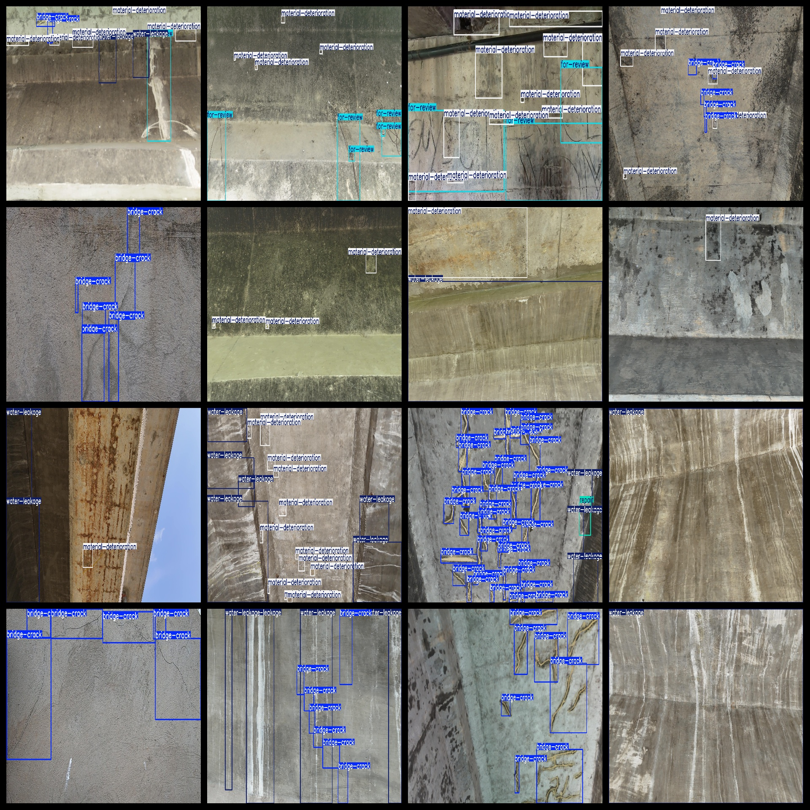
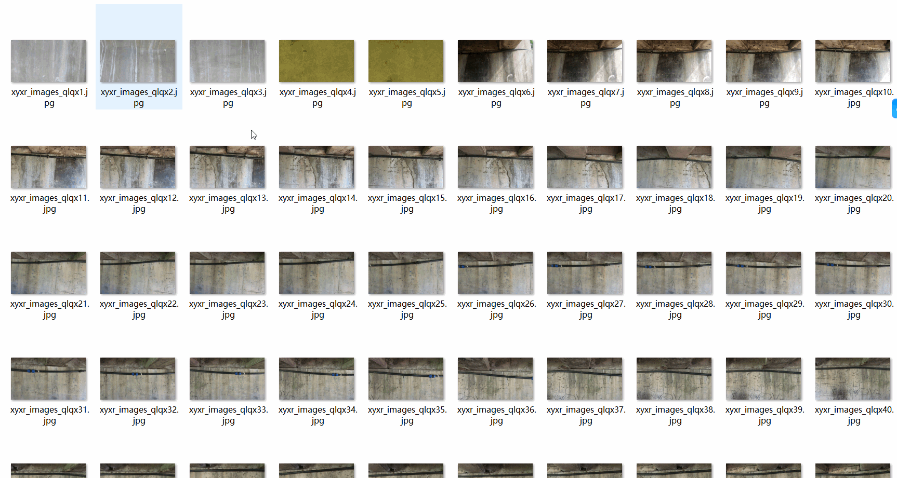

# [Object Detection] Bridge Surface Defect 4318 imagesYOLO+VOC format

[Target Detection] Bridge Surface Defect 4318 Images in YOLO and VOC Format

Dataset Format: VOC format + YOLO format

The zip file contains 3 folders, each storing images, xml, and txt files.

In the JPEGImages folder, there are a total of 4318 JPG images.

In the Annotations folder, there are a total of 4318 xml files.

In the labels folder, there are a total of 4318 txt files.

Number of label types: 5

Label names: ["bridge-crack", "for-review", "material-deterioration", "repair", "water-leakage"]

Labels: [“Bridge Crack”, “Review”, “Material Deterioration”, “Repair”, “Leakage”]

Each label category number (Note that the order of categories in the Yolo format doesn't match this, but is based on the classes.txt in the labels folder):

bridge-crack category number = 18764

for-review category number = 2089

material-deterioration category number = 14726

repair category number = 1531

water-leakage category number = 4628

Total category numbers: 41738

Image resolution clarity (pixel size): Clear

Image enhancement status: Yes

Label shape: Rectangular box, used for target detection identification

Important note: No guarantee of the accuracy or weights of the trained model provided in this dataset. The dataset only provides accurate and reasonable annotations.

Annotation and image details as follows:
## Images

---

Here is a pay link on Stripe (https://buy.stripe.com/3cs8yP7sY87d0vu9AB). Please contact me lonlonago@foxmail.com after funding $89, and I will send you a complete data files, thank you!

